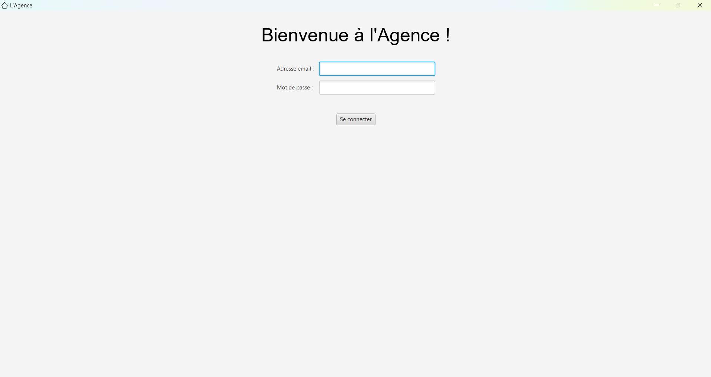
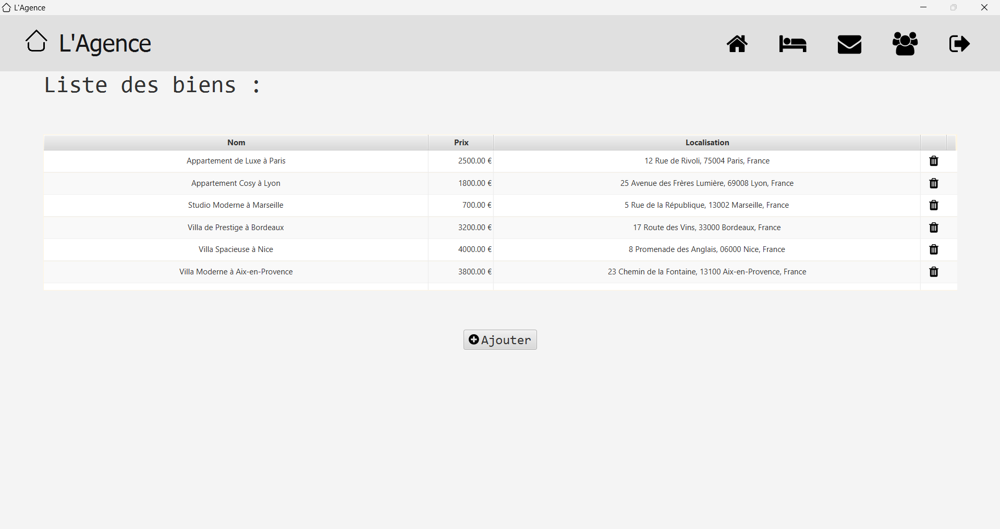

#  L'agence - Desktop


This repository contains the source code for the **L'agence** desktop application. The application is designed to manage accommodation requests, user authentication, and various other functionalities related to real estate management.

## Screenshots

### Login Page


### Home Page


## Technologies

- **JavaFX**: For building the user interface.
- **HttpClient**: For making HTTP requests.
- **Jackson**: For JSON processing.
- **Maven**: For project management and dependency management.

## Requirements

- **Java 11** or higher.
- **Maven**: For building the project.

## Installation

Clone the repository:

```bash
git clone https://github.com/JAWS-tm/L-agence.git
cd L-agence
```

Install the dependencies:

```bash
mvn install
```

## Usage

Run the application:

```bash
mvn javafx:run
```

## Backend API

The desktop application communicates with a backend API. The backend repository can be found [here](https://github.com/JAWS-tm/L-agence).

### API Endpoints

- **Login**: `/auth/login`
- **Logout**: `/auth/logout`
- **Get Accommodation Requests**: `/accommodation/requests`
- **Get User Details**: `/user/details`

## Deployment

### Local Deployment

To run the application locally, use the following command:

```bash
mvn javafx:run
```

### Server Deployment

For server deployment, ensure you have the backend API running and accessible. Update the `baseUrl` in the `RequestService` class to point to your backend server.

## Related

- [L'agence - Web](https://github.com/JAWS-tm/L-agence)

## License

This project is licensed under the MIT License. See the LICENSE file for details.